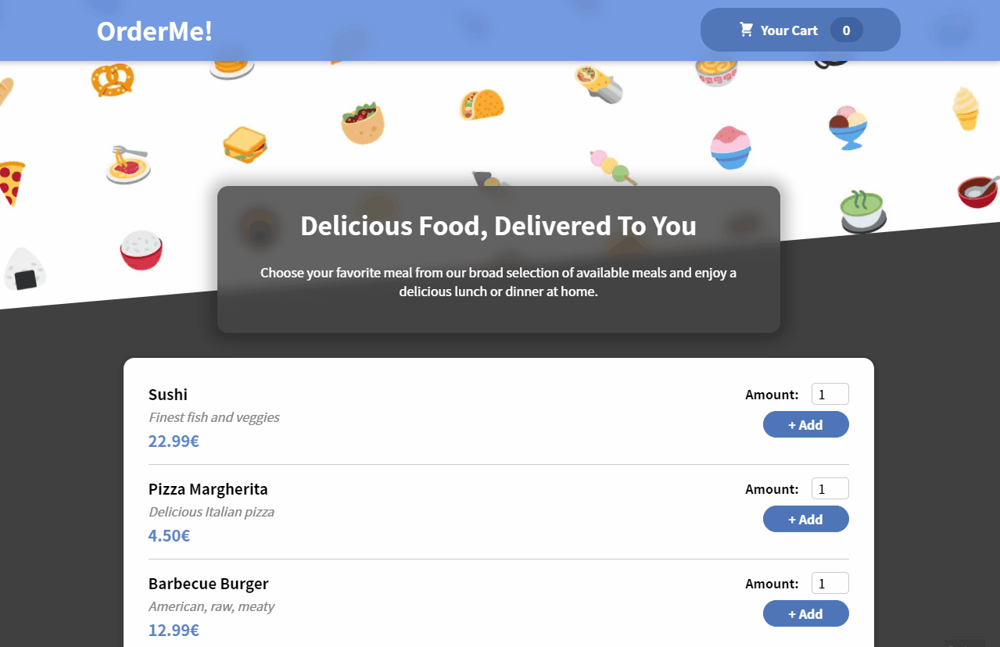

 
# OrderMe

>### An easy to use food order application built with React and Firebase

## Features

- Fetch meals from Firebase
- Loading and error state handling
- Increase/decrease order amount
- Cart and order summary
- Order form validation
- Send order to Firebase

## Demo

- https://order-me.netlify.app/
